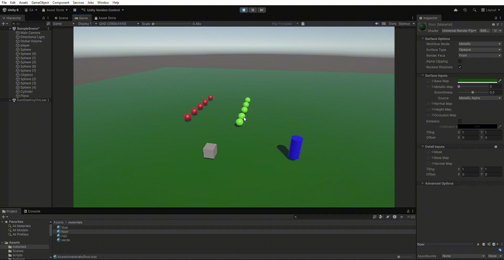
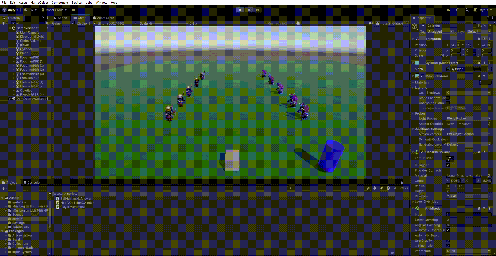
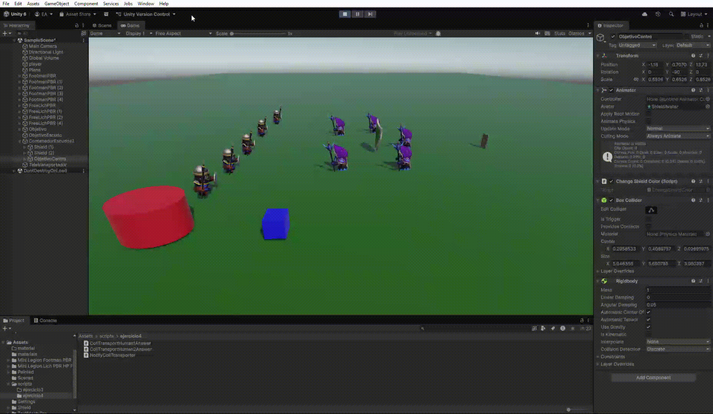
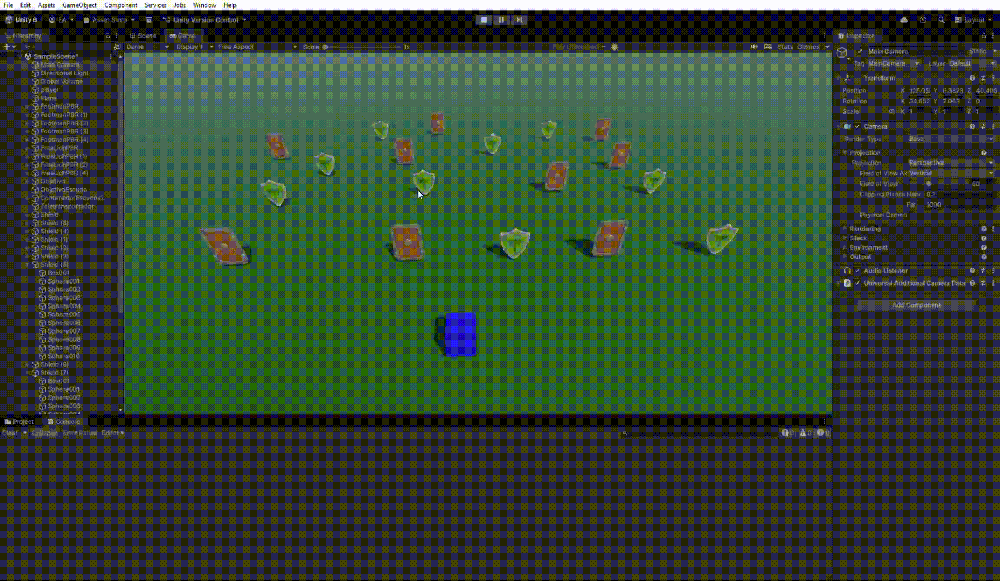
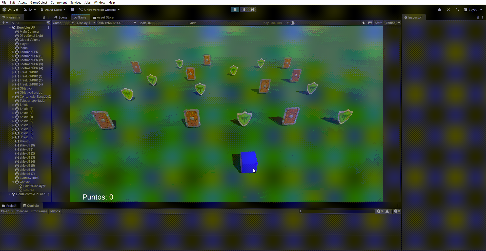
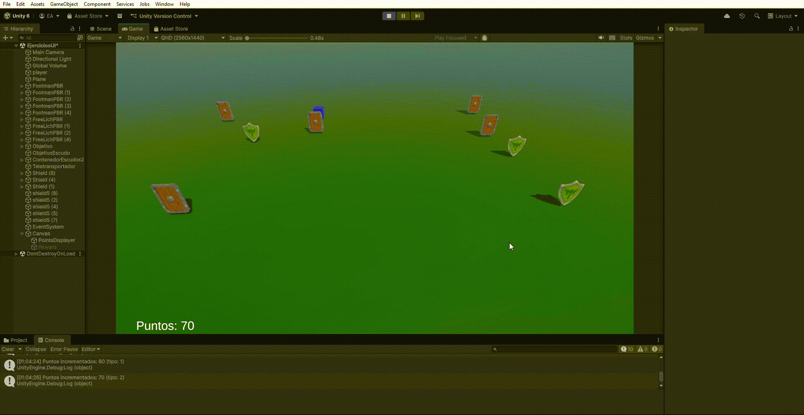

# Interfaces Inteligentes - Eventos

- **Enmanuel Vegas Acosta** (alu0101281698)
- **Práctica 4**: Eventos

## **Ejercicios de Eventos en Unity**

### **- Ejercicio 1:**

_Crea una escena con 5 esferas, rojas que las etiquetas de tipo 1, y verdes de tipo 2. Añade un cubo y un cilindro. Crea la siguiente mecánica: cuando el cubo colisiona con el cilindro, las esferas de tipo 1 se dirigen hacia una de las esferas de tipo 2 que fijes de antemano y las esferas de tipo 2 se desplazan hacia el cilindro._

Para este primer ejercicio se ha procedido a crear un [script](/scripts/NotifyCollisionCylinder.cs) que envía un mensaje cuando el cubo toca el cilindro, y [otro](/scripts/BallHumanoidAnswer.cs) asociado a las bolas para determinar el movimiento a realizar. A través de este último, las bolas pueden "suscribirse" al mensaje que puede emitir el cubo en cualquier momento, disparando las acciones a realizar.

### **- Ejercicio 2:**

_Sustituye los objetos geométricos por humanoides._

Simplemente descargamos los elementos de la `Asset Store` y realizamos el cambio de elementos (agregando los correspondientes Colliders a cada objeto).

### **- Ejercicio 3:**

_Cuando el cubo colisiona con cualquier humanoide tipo 2, los del grupo 1 se acercan a un escudo seleccionado. Cuando el cubo toca cualquier humanoide del grupo 1 se dirigen hacia los escudos del grupo 2 que serán objetos físicos. Si algún humanoide a colisiona con uno de ellos debe cambiar de color._

**Primera parte: Colisión con humanoides tipo 2**. Se ha creado [otro script](./scripts/NotifyCollHumanoids.cs) que envía un mensaje cuando el cubo colisiona con algún humanoide de tipo 2. Los humanoides de tipo 1 están suscritos a este mensaje y ejecutan las acciones correspondientes gracias a [este script](./scripts/CollHumanoid2Answer.cs).

**Segunda parte parte: Colisión con humanoides tipo 1**. La idea es idéntica aunque cambian los elementos que intervienen y las acciones a realizar. [Ver script](./scripts/CollHumanoid1Answer.cs).

### **- Ejercicio 4:**

_Cuando el cubo se aproxima al objeto de referencia, los humanoides del grupo 1 se teletransportan a un escudo objetivo que debes fijar de antemano.Los humanoides del grupo 2 se orientan hacia un objeto ubicado en la escena con ese propósito._

El funcionamiento sigue siendo similar a los casos anteriores. El cubo tendrá vinculado [este script](./scripts/ejercicio4/NotifyCollTransporter.cs). Los humanoides tipo 1, [este script](./scripts/ejercicio4/CollTransportHuman1Answer.cs), y los de tipo 2, [este](./scripts/ejercicio4/CollTransportHuman2Answer.cs).

### **- Ejercicio 5:**

_Implementar la mecánica de recolectar escudos en la escena que actualicen la puntuación del jugador. Los escudos de tipo 1 suman 5 puntos y los de tipo 2 suman 10. Mostrar la puntuación en la consola._

En este caso, se detectan las colisiones resultantes y se controla la lógica con [este script](./scripts/ejercicio5/IncreasePoints.cs).

### **- Ejercicio 6:**

_Partiendo del script anterior crea una interfaz que muestre la puntuación que va obteniendo el cubo._

Partimos del ejercicio anterior como base. [Modificamos el script](scripts/ejercicio6_8/ShowPoints.cs) con el que estábamos trabajando para que notifique cuando se colisione con un escudo. La UI recibirá la nueva cantidad de puntos con [este script](scripts/ejercicio6_8/ShowPoints.cs) y actualizará el texto.

### **- Ejercicio 7:**

_Partiendo de los ejercicios anteriores, implementa una mecánica en la que cada 100 puntos el jugador obtenga una recompensa que se muestre en la UI._

Para este caso, solamente activamos un sprite cada vez que el jugador llegue a los 100 puntos. [Ver script](./scripts/ejercicio6_8/ShowPoints.cs). 

### **- Ejercicio 8:**

_Genera una escena que incluya elementos que se ajusten a la escena del prototipo y alguna de las mecánicas anteriores._

La mecánica agregada es la perder puntos cada vez que se colisione con un "enemigo", ya que eso es una mecánica que hemos de aplicar en nuestro prototipo final. El contador de puntos puede tomar valores negativos.

### **- Ejercicio 9:**

_Implementa el ejercicio 3 siendo el cubo un objeto físico._

El cubo siempre ha sido un objeto físico y cinemático, para poder movernos de manera cómoda con el controlador.

